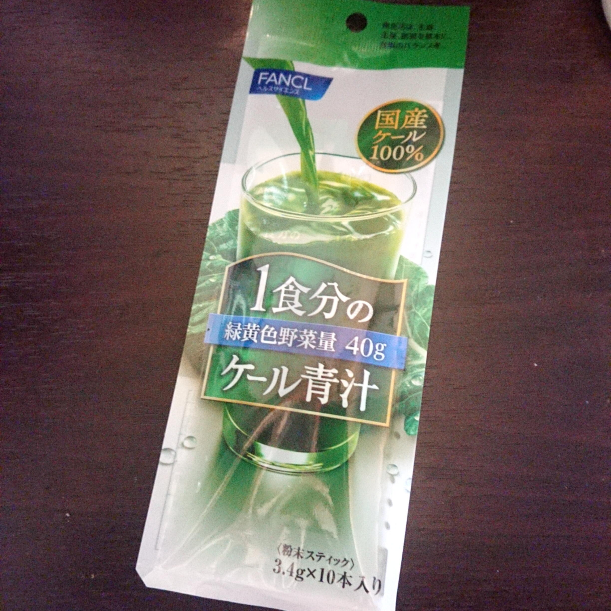
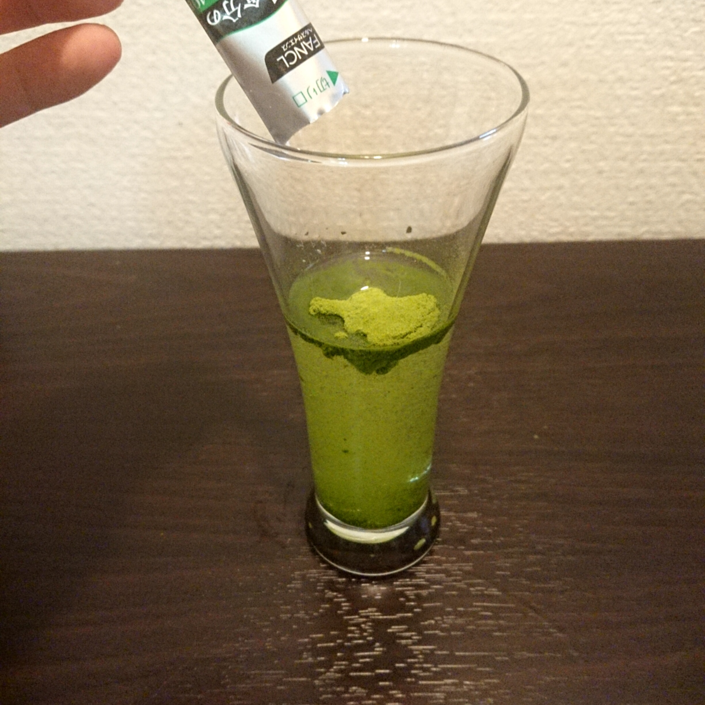
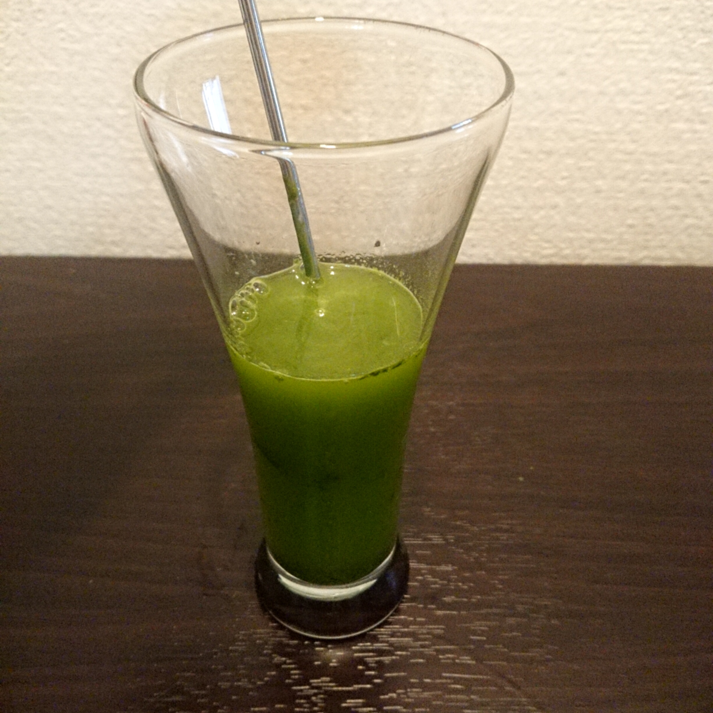

あー今日はなんだか自炊するのだるいなー  
雨も降っていて買い物に行けないなー  

この時期ってそんな気分にどうしてかなってしまいます。  
でも栄養あるものとらないとなあどうしようかなあ・・・  

と思っているとピンポンとともに、  
「ヨドバシ電気でーす」と声が。  
何ぽちったんだっけ・・・  

私は**国産素材の豆板醤を買うついで**にどうやら、  
**ケール青汁を購入**していたらしい。  
昨日深夜の私は、何を考えていたのだろうか。

正直記憶にない。

簡単に野菜取れないかなあと思って青汁を買うのはこれで3種類目ぐらいかなあ。  
今まで買っていた2種類は大麦若葉が主成分で、  
なんだかまずくはないけど味が無いかも？みたいな味で、
飲みやすく水に溶けやすいけど食物繊維が中心感があったので、  
ビタミンだとかポリフェノールもとれるそうなこれを試しに。  

早速お水に溶かしてみます。  

マドラーで混ぜたら**10秒ほどで溶け切りました。**  
溶けやすさって粉末飲料では大事です！

そして気になるのは味ですよね！  
では飲んでみます・・・  

最初はやっぱり**無味かな**と感じたのですけど  
**後味がブロッコリー**でした。  
**青汁はまずくもおいしくもない**ものが正直多いようなと思います。  
それが少しマイブームでもありますｗ

