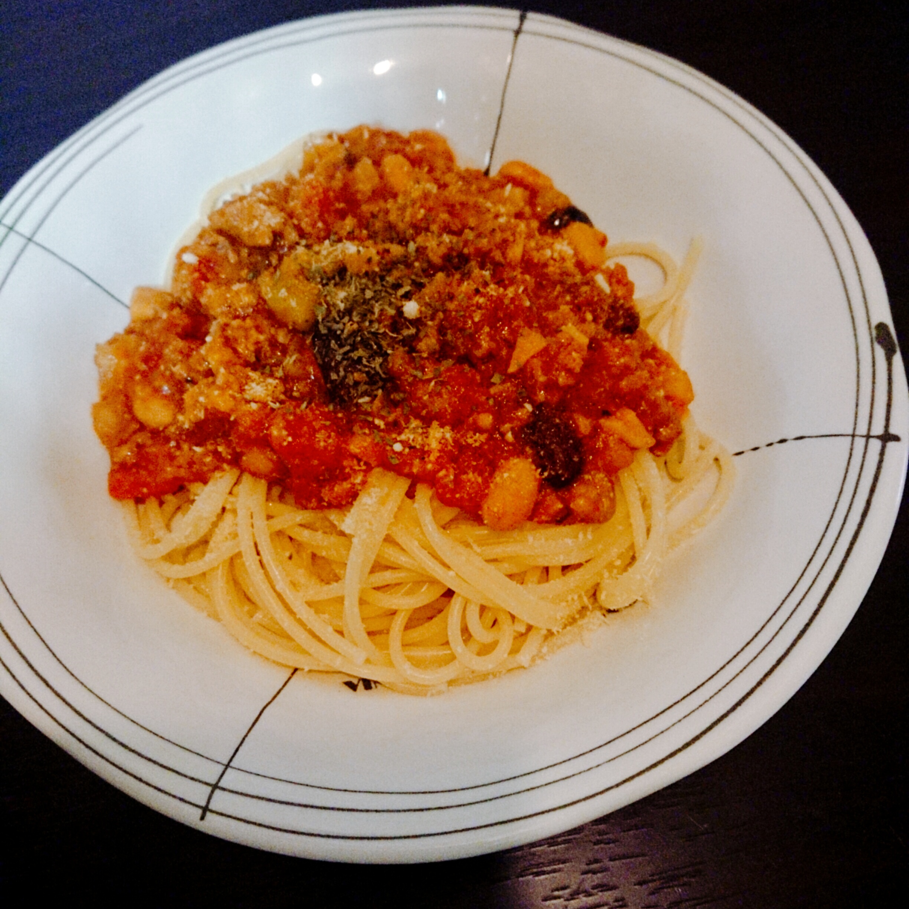

そろそろ料理記事を投稿したかったのに、

今日のランチは残り物をさらえてしまったので、

スマホをあさっていたら見つけた。

# 手作りミートソース

1. まず以下の材料をみじん切りって下ごしらえておきます。

- セロリ　1本
- 玉ねぎ　半分
- なにかしらキノコ(確かこれはエリンギ)　エリンギで1~2本

2. フライパンにバターを広げ熱し、強火で玉ねぎを入れます。

   しんなりしたかな(適当)ぐらいで、

   セロリと以下材料をぶちこんで火を通します。

   お肉に火が通っていたら次に行きます。

- 合いびき肉　こぶし2個分ぐらい？たぶん200g

3. 以下の材料をぶちこみます。

   ぶち込み終わったら中火ぐらいにして再沸騰するまで待ちます。

   私は`そういえば電気圧力鍋で加圧8分で行った気が`してきました。

- トマト缶　1缶
- ニンニクチューブ　人差し指の長さぐらい
- 中濃ソース　大匙１　個人的にカゴメがおすすめ
- ケチャップ　大匙2
- 赤ワイン　コップ4分の1ぐらいだぼ×3ぐらい　安いやつでいい
- 砂糖　大匙1(安い赤ワインの場合は必須)
- ローリエ(ローレル???)　1枚

4. ローリエだかローレルだかを取り出し、

   仕上げに以下を入れて味見をして塩コショウを調整して完成。

- ミックスビーンズ(あれば	1パック
- 塩コショウ　気分(3振りぐらい
- 一味　適量

完成はこんな感じ。

もしも電気圧力鍋をお持ちであれば、

すべての材料を電気圧力鍋にぶち込んで加圧8分をすると、

簡単にできます。

たまにレトルトじゃなくて

手作りが食べたくなるんですよねー

是日試してみてください！！