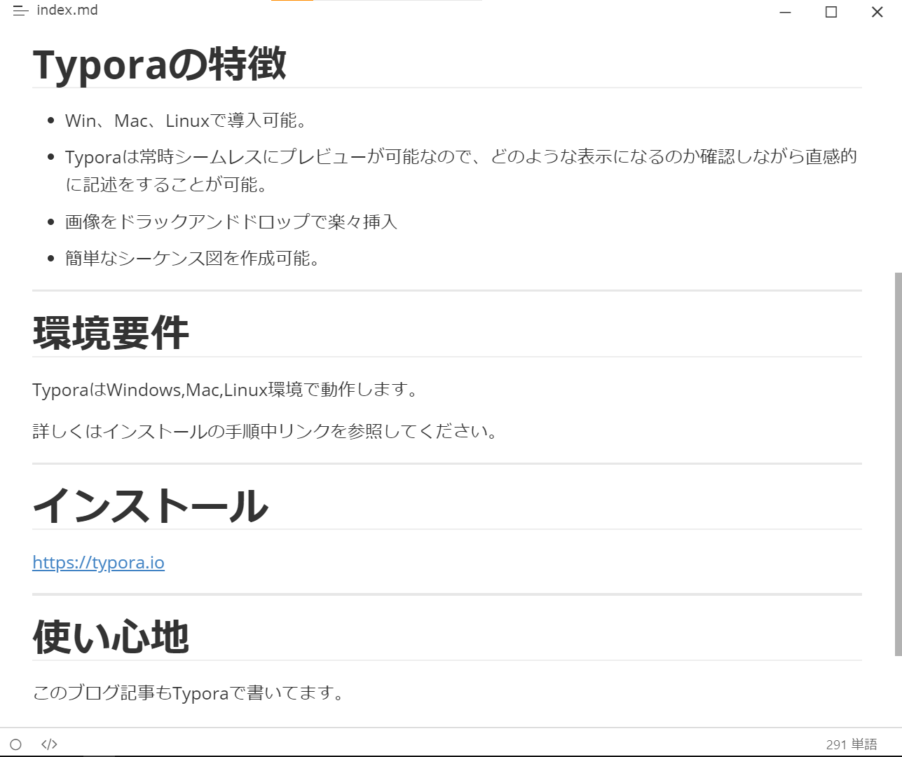

今回は無料の強力なMarkdowエディタ「Typora」について記事にします。

TyporaはMarkdownエディタとして比較的敷居も低く、便利機能もたくさん存在するため、

初心者から上級者までお勧めができるエディタです。

---

# Typoraの特徴

- Win、Mac、Linuxで導入可能。
- Typoraは常時シームレスにプレビューが可能なので、どのような表示になるのか確認しながら直感的に記述をすることが可能。
- 画像をドラックアンドドロップで楽々挿入
- 簡単なシーケンス図を作成可能。

---

# 環境要件

TyporaはWindows,Mac,Linux環境で動作します。

詳しくはインストールの手順中リンクを参照してください。

---

# インストール

https://typora.io

---

# 使い心地

このブログ記事もTyporaで書いてます。

なにより**プレビュー画面と編集画面が一つでよい**点が

本当に使い心地よいです！！

皆さんもぜひ使ってみてください。
