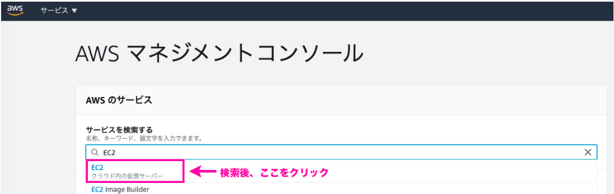
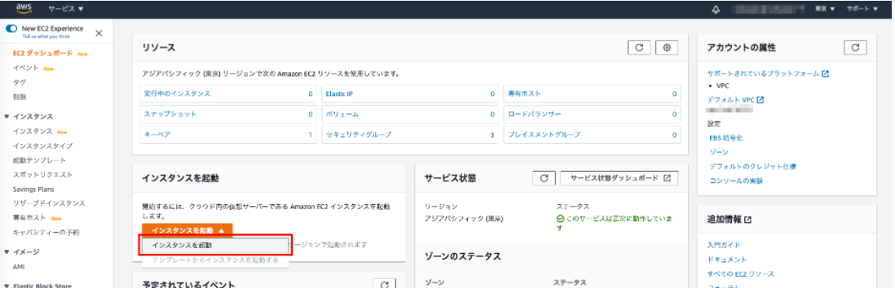
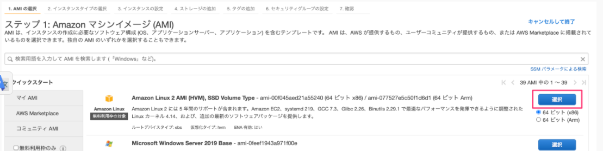
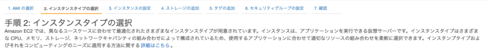
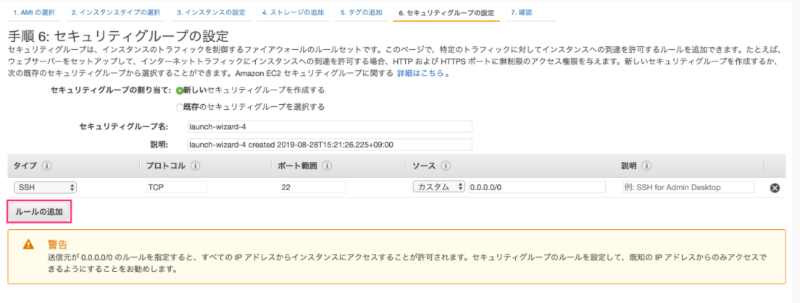
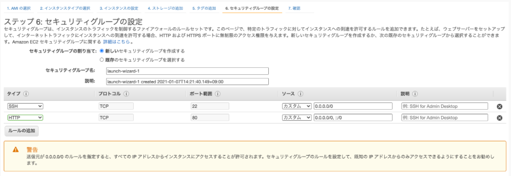
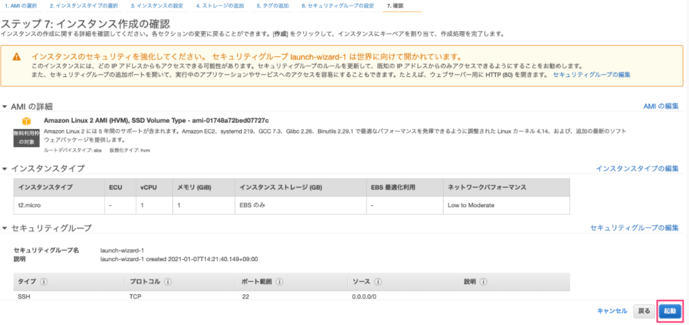
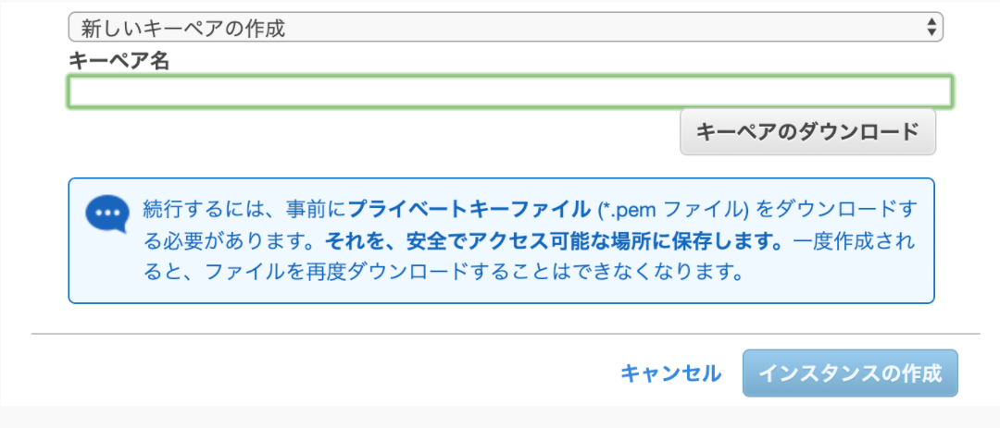
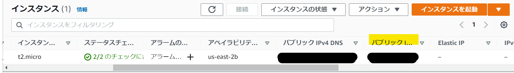
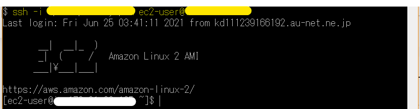

今ポートフォリオを作成しているんですけど、

EC2でWebサーバーを立ててきました。

その時のメモを記事にします。

# EC2とは

AWSのサービスの1つで、「EC2（Amazon Elastic Compute Cloud）」は、AWSが提供する仮想サーバーです。読みは「**イーシーツー**」でいいみたいです。

EC2は無料枠があります。

# EC2でWebサーバーを作成する

それでは、実際にEC2でWebサーバーを作って試してみましょう。
以下の手順で行います。

1. EC2インスタンスを作成する
2. EC2にログインする
3. EC2インスタンスの環境構築
4. サーバーに「Nginx」をインストールする
5. ブラウザからWebサーバーにアクセスする
6. Nginx用のHTMLを作成する
7. サーバーを停止する

# EC2インスタンスを作成する

AWSにアクセスし、マネジメントコンソールのサービス検索で「**EC2**」を検索



**【注意】**

サインアップが完了してから利用できるようになるまで、24時間ほどかかる場合があります。
この場合、「サービスへのお申し込みはあと少しで完了です！」画面が表示されます。
「AWSへの登録を完了してください」をクリックして登録を完了し、「クレジットカード情報」をクリックして情報を確認しておきましょう。

EC2にアクセスされると、「EC2ダッシュボード」画面が表示されます。
左下の「インスタンスを起動」をクリックします。



Amazon マシンイメージにはAmazon Linux 2 AMIを選択します。





「2. インスタンスタイプの選択」画面が表示されます。

「6.セキュリティグループの設定」をクリックします。




「6. セキュリティグループの設定」画面が表示されます。

左下の「ルールの追加」をクリックします。



「ルールの追加」をクリックすると、その下に行が追加されます。

追加行の「タイプ」で「カスタムTCP」をクリックし、表示されるメニューで「**HTTP**」を選択します。

設定できたら、右下の「確認と作成」をクリックします。



「7. 確認」画面が表示されます。
正しく設定されていることを確認し、よければ右下の「起動」をクリックします。



「既存のキーペアを作成するか、新しいキーペアを作成します」画面が表示されます。

「既存のキーペアの選択」のメニューで「新しいキーペアを作成」を選択し直します。

「キーペア名」欄に好きなキーの名前入力し、右下の「キーペアのダウンロード」をクリックします。

キーペアをダウンロードする画面が表示されるので、ダウンロードします。
ダウンロードが終わったら、「インスタンスの作成」をクリックします。



「作成ステータス」画面が表示されます。

「インスタンスは現在作成中です」の右側にある番号（インスタンスID）をクリックします。

「パブリックIPv4アドレス」のアドレスをコピーしておきます。



# EC2にログインする

ローカルコマンドラインから以下を入力します。

```ssh -i キーパス ユーザ名(ec2-user)@コピーしたアドレス```



# EC2インスタンスの環境構築

パッケージのバージョンを管理するにはyumコマンドを使います。

まずはyumコマンドでパッケージをアップデートします。

```
sudo yum update
```

必要なパッケージをインストールします。


Amazon LInuxは初期状態だと必要最低限のパッケージしか入っていません。

なのでよく利用するパッケージをインストールしていきます。

今回はRailsアプリが動くよう下記のパッケージをインストールします。

| 名前              | 役割                         |
| ----------------- | ---------------------------- |
| gcc-c++           | c++のコンパイラ              |
| make              | ソースコードからビルドできる |
| patch             | ファイルの修正や生成ができる |
| git               | バージョン管理ができる       |
| curl              | データを転送できる           |
| zlib-devel        | データの圧縮や伸張ができる   |
| openssl-devel     | 通信を暗号化する             |
| ImageMagick-devel | 画像を操作したり表示できる   |
| readline-devel    | CUIで行入力を支援してくれる  |
| libcurl-devel     | curlを扱える                 |
| libffi-devel      | FFIの機能を扱える            |
| libyaml-devel     | yamlファイルを扱える         |
| libicu-devel      | Unicodeを扱える              |
| libxml2-devel     | XMLを解析できる              |
| libxslt-devel     | XMLにXSLを適用させる         |

インストールするコマンドは下記

```sudo yum -y install gcc-c++ make patch git curl zlib-devel openssl-devel ImageMagick-devel readline-devel libcurl-devel libffi-devel libicu-devel libxml2-devel libxslt-devel```

nodeをインストールします。

```bash
# AWSのリポジトリに追加
curl -sL https://rpm.nodesource.com/setup_14.x | sudo bash -
# インストール
sudo yum -y install nodejs
```

次はrubyのバージョン管理ツールであるrbenvをインストールします。
下記のコマンドを実行します。

EC2ターミナル | rbenvのインストール

```bash
# レポジトリをクローンしてインストール 
git clone https://github.com/sstephenson/rbenv.git ~/.rbenv 
# .bash_profileの設定 
echo 'export PATH="$HOME/.rbenv/bin:$PATH"' >> ~/.bash_profile 
echo 'eval "$(rbenv init -)"' >> ~/.bash_profile 
source .bash_profile 
```

次はrubyをインストールするためのruby-buildをインストールします。

EC2ターミナル | ruby-buildのインストール

```bash
git clone https://github.com/sstephenson/ruby-build.git ~/.rbenv/plugins/ruby-build 
```

これでrubyをインストールできるようになりました。


```bash
ssh-keygen -t rsa
cat ~/.ssh/id_rsa.pub
```

これら表示されている文字を最初の「ssh-rsa」から最後の「.internal」まで全てコピーしましょう。

nginxをインストールします。

```sudo amazon-linux-extras install nginx1```

