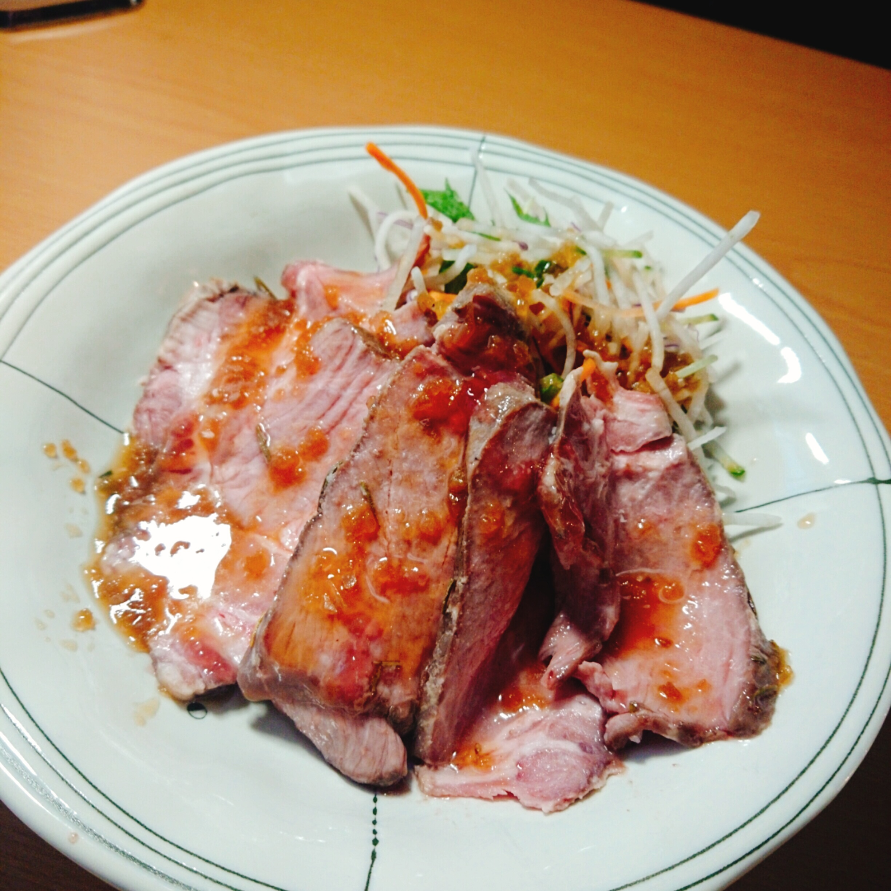

暑くなってきましたが、サラダでもいただけて、

比較的ローストビーフよりお安くさっぱりいただける

ローストポークを作ってみてはいかがでしょうか！？

# 作り方

## まずジップロックに以下材料を入れ漬け込みます。

空気を抜いて閉めます。

**材料**

- 豚ブロック肉　目安400g前後
- 粗塩　気持ち多め
- 砂糖　大匙2
- ローズマリーみじん切り　適量

**機材**

- ジップロック

## 低温調理器にお水を張り、65度で2時間調理します。

**機材**

- 電気圧力鍋

  (今回はこちらを使用しました。https://www.t-fal.co.jp/products/electric-pressurecookers/manual-cooking/lakulacookercompact/)

## まな板ので薄くスライスし、お好みでドレッシングや野菜を添えて完成です。

**材料**

- 玉ねぎドレッシング
- 市販の大根サラダ
