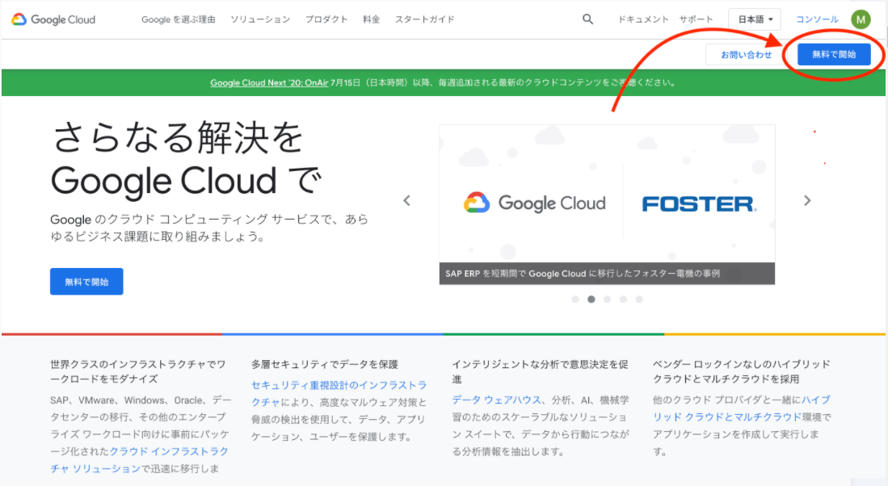
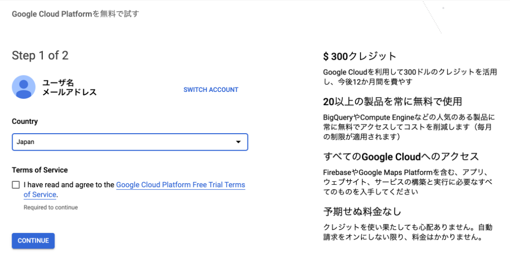
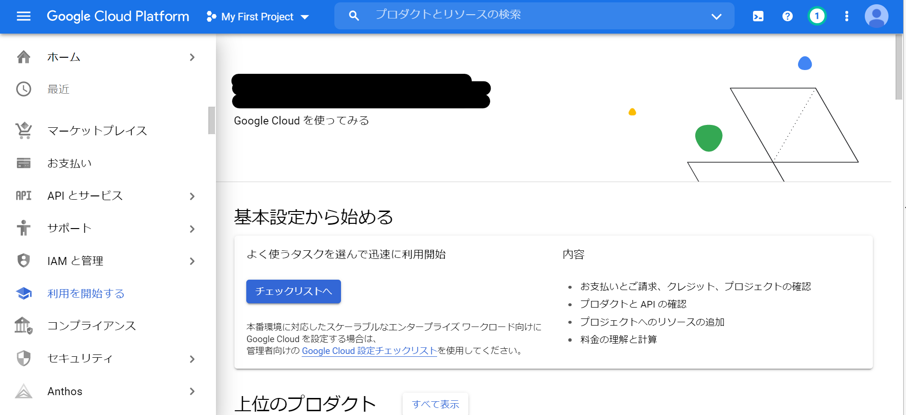

# Google Vision API

画像認識を提供してくれるらしいサービスみたいです。

これでAIの目ができるんじゃあないでしょうか

色々使えそうなので試していきます。

## 使うまでの準備

- GCPの登録
- GCPプロジェクト作成

### Google Cloud Platformの登録

今回使用するのは、Google社が提供しているVision APIというサービスになります。

https://cloud.google.com/vision/?hl=ja

Vision APIを利用するためには、事前にGoogle Cloud Platformに登録する必要があります。

[こちら](https://cloud.google.com/)からGoogle Cloudのアカウント登録をします。

クレジットカードの入力を求められますのでお手元に準備して入力などなどを行います。

するとGCPのホーム画面が表示されます。

## GCPプロジェクト作成

