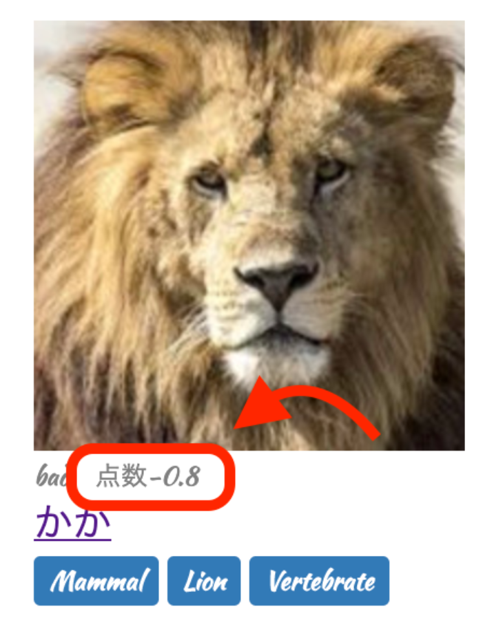

# Google Natural Language API (自然言語処理)

目次

- APIを使用するための前準備
- Natural Language APIを使う
- 実際にコードを書いてみよう

## APIを使用するための前準備

この章ではGoogle Natural Language APIを使用して感情分析を実践していただきます。

また、前章でGoogle Cloud Platformの登録、プロジェクトの作成、API KEYの発行は済んでいますのでNatural Language APIの有効化から始めましょう。

Natural Language APIの有効化は前章の「Vision APIの有効化」を参考にしましょう。

APIの検索には「natural」と入力するといいでしょう。

（もし、Google Cloud Platformの登録をしていない方は、[こちら](https://web-camp.online/lesson/curriculums/197/contents/1149#gcp-create)を確認して登録してみましょう。）

## Natural Language APIを使う

Cloud Natural Language APIの種類

| 機能のタイプ         | 説明                                                         |
| -------------------- | ------------------------------------------------------------ |
| 感情分析             | 指定されたテキストを調べて、そのテキストの背景にある感情的な考え方を分析します。 |
| エンティティ分析     | 指定されたテキストに既知のエンティティ（著名人、ランドマークなどの固有名詞）が含まれていないかどうかを調べて、それらのエンティティに関する情報を返します。 |
| 構文解析             | 指定されたテキストの内容を分析します。                       |
| エンティティ感情分析 | エンティティ分析と感情分析の両方を組み合わせたものであり、テキスト内でエンティティについて表現された感情（ポジティブかネガティブか）の特定を試みることが可能です。 |

今回、お見せするデモでは、 感情分析 を用いて、投稿された内容がポジティブな内容かネガティブな内容かを判断してみますが、皆さんそれぞれ作りたいプロダクトに応じて、どの機能を使用するか考えてみましょう。

APIの仕様については、こちらのリンクに詳細があります。

https://cloud.google.com/natural-language/docs/apis?hl=ja

基本的には、以下のコード部分で紹介する内容をそのまま用いれば問題ないようになっています。

### 実際にコードを書いてみよう

前章で作成したsample_app_demo_apiを使用して、実装を進めていきます。

最終的には、「sample_app ＋ Google Vision API ＋ Google Natural Language API」の形になります。

Google Cloud Natural Language APIを呼ぶためのライブラリを作成してみましょう。
自分で作成するライブラリに関しては、 lib 以下に作成しましょう。今回は、 lib/language.rb というファイルを作成します。

lib/language.rb

```
require 'base64'
require 'json'
require 'net/https'

module Language
  class << self
    def get_data(text)
      # APIのURL作成
      api_url = "https://language.googleapis.com/v1beta1/documents:analyzeSentiment?key=#{ENV['GOOGLE_API_KEY']}"
      # APIリクエスト用のJSONパラメータ
      params = {
        document: {
          type: 'PLAIN_TEXT',
          content: text
        }
      }.to_json
      # Google Cloud Natural Language APIにリクエスト
      uri = URI.parse(api_url)
      https = Net::HTTP.new(uri.host, uri.port)
      https.use_ssl = true
      request = Net::HTTP::Post.new(uri.request_uri)
      request['Content-Type'] = 'application/json'
      response = https.request(request, params)
      # APIレスポンス出力
      response_body = JSON.parse(response.body)
      if (error = response_body['error']).present?
        raise error['message']
      else
        response_body['documentSentiment']['score']
      end  
    end
  end
end
```

response.body の中身には以下のような内容(hash)が入ってきます。
response.bodyの部分でエラーが起きた際は、以下の内容が正しく返ってきていない可能性があります。
デバッグなどで、意図した情報をAPIに渡せているか確認しましょう。

※ Google APIに渡せる画像サイズには制限があります。APIのドキュメントで確認してみましょう。

```
{
  "documentSentiment"=>{
    "polarity"=>1, "magnitude"=>0, "score"=>0}, "language"=>"en",
    "sentences"=>[
    {
      "text"=>{"content"=>"test", "beginOffset"=>-1},
      "sentiment"=>{"polarity"=>1, "magnitude"=>0, "score"=>0}
    }
  ]
}
```


それでは実際に、controller側から、先程作成したNatural Language APIを呼び出してみましょう。

今回は、bodyの内容がポジティブな内容かネガティブな内容かを「-1.0〜1.0」で返してくれるので、それを保存します。

まずはAPI側から返ってきた値を保存するカラム（score）を作成してみましょう。

以下コマンドを実行しましょう。

```
$ rails g migration AddScoreToLists 'score:decimal{5,3}'
$ rails db:migrate
```


以下では、createアクション内に以下の記述をすることで、投稿した本文を Language.get_data(list_params[:body]) でAPI側に渡しています。
その後、API側から返ってきた値をもとに、スコアを作成しています。

app/controllers/todolists_controller.rb

```
class TodolistsController < ApplicationController
  def new
    @list = List.new
  end
  def create
    list = List.new(list_params)
    list.score = Language.get_data(list_params[:body])  #この行を追加    list.save
    tags = Vision.get_image_data(list.image)
    tags.each do |tag|
      list.tags.create(name: tag)
    end
    redirect_to todolist_path(list.id)
  end
  def index
    @lists = List.all
  end
  def show
    @list = List.find(params[:id])
  end
  def edit
    @list = List.find(params[:id])
  end
  def update
    list = List.find(params[:id])
    list.update(list_params)
    redirect_to todolist_path(list.id)
  end
  def destroy
    list = List.find(params[:id])
    list.destroy
    redirect_to todolists_path
  end

  private
  def list_params
    params.require(:list).permit(:title, :body, :image)
  end
end
```


最後に、本文の点数を表示するためにviewファイルを編集します。

index.html

【変更前】

app/views/todolists/index.html.erb

```ruby
:
:

<span class="list-body"><%= list.body %></span>

:
:
```


【変更後】

app/views/todolists/index.html.erb

```ruby
:
:

<span class="list-body"><%= list.body %></span>
<span class="sentiment-score">本文の感情分析スコア<%= list.score %></span>

:
:
```


show.html

【変更前】

app/views/todolists/show.html.erb

```ruby
:
:

<p><%= @list.body %></p>

:
:
```


【変更後】

app/views/todolists/show.html.erb

```ruby
:
:

<p><%= @list.body %></p>
<p class="sentiment-score">本文の感情分析スコア[<%= @list.score %>]</p>

:
:
```


投稿をすると、その投稿内容に応じて、-1.0〜1.0の値が入るようになります。

皆さんが実際プロダクトを作る際には、その値に応じて、削除ボタンをレコメンドしてみたり、コメントのスコアに応じて色分けしてみたり、色々と工夫を凝らしてみてください。



前の章へ[一覧](https://web-camp.online/lesson/curriculums/197/chapters/89)次の章へ
