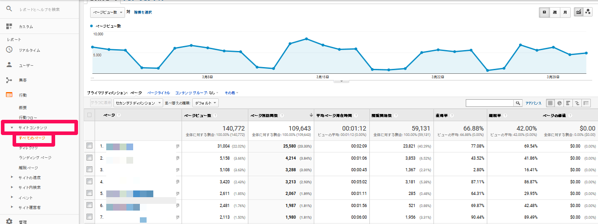

googleアナリティクスとは基本無料の**サイト解析サービス**でして、

登録したサイトへアクセスしたユーザーがとった行動に関するデータが見れます。例えば、

「サイトの訪問者数はどれくらいか」

「どのページがよく見られているのか」

「訪問者はどこから来たのか」

「使われたデバイスはスマホかパソコンか」

などなどです。

## googleアナリティクスの始め方

### 1) Googleアカウントを作成しログインしておく

とはいっても既に持っている人が多いと思うので割愛します。

### 2) Googleアナリティクスアカウントを作成

次にGoogleアナリティクスアカウントを作成します。ここでは分析したいサイトのURLなどを入力し、トラッキングコードと呼ばれるタグを取得します。
このトラッキングコードをページのHTMLに設置し、それが読み込まれることで、Googleアナリティクスでデータを計測できるようになります。

### 3) トラッキングコードを設置

最後に、先ほど取得したトラッキングコードを全てのページに設置します。

またHUGOでブログを作っている方は、トラッキングコード内のトラッキングIDをコピーし「config.yaml」などのconfigファイルに以下を追記しコンパイルすると完了します。

```yaml
# GA Tracking ID
googleAnalytics: "UA-123456789-1" #トラッキングIDを入力
```


## Googleアナリティクスの使い方 | 必須の4機能

導入が完了したら、実際にGoogleアナリティクスを使ってみましょう。
Googleアナリティクスは項目が多くて一見複雑そうですが、実はチェックするべき機能はたったの4つです。
以下では、「ユーザー」「集客」「行動」「コンバージョン」という基本的な機能について概要を説明していきます。

### 1) 「ユーザー」メニュー

まずは「ユーザー」です。
このメニューでは、サイトの訪問数(セッション数)やページビュー数、使用しているデバイスなど、ユーザーに関する幅広いデータを見ることができます。

まずは「概要」をクリックしてみてください。


アクセス解析において、まずはこの「概要」ページでサイト全体の訪問者数を確認することがはじめの一歩となります。
その後ページ毎の分析の際にも、サイト全体の平均と比べてどうなのか、という視点が大事です。
アクセス解析において最もお世話になるのがこの「概要」メニューと言っても差し支えないでしょう。

次に、「モバイル」>「概要」をクリックしてみてましょう。


ここではユーザーの使用しているデバイス(パソコン・スマホ)が何なのかがわかります。
この項目をきちんとチェックすることで、施策の優先度を見極めることができます。
たとえばスマホユーザーが多いので、スマホ用サイトを優先的に改善するなどの意思決定ができます。

### 2) 「集客」メニュー

「集客」メニューでは、ユーザーサイトにどこから訪れたかがわかります。
具体的には、「Google検索で流入した」「Facebook広告から流入した」などがわかります。

「集客」>「すべてのトラフィック」>「チャネル」を確認してみましょう。


「集客」チャネルでは以下のデータを確認することができます。


| Organic Search | Google、Yahooなどで検索してサイトに流入した訪問              |
| :------------- | ------------------------------------------------------------ |
| Paid Search    | 検索後、リスティング広告などをクリックしてサイトに流入した訪問 |
| Direct         | URLを直接入力したり、ブックマークからサイトに流入した訪問    |
| Referral       | 他のサイトのリンクをクリックしてサイトに流入した訪問         |
| Social         | FacebookやTwitterなどのSNSからサイトに流入にした訪問         |
| Display        | バナー広告をクリックしてサイトに流入した訪問                 |
| Other          | その他                                                       |

### 3) 「行動」メニュー

「集客」メニューがユーザーのサイト訪問前の行動を確認するために役立つのに対して、「行動」メニューではユーザーのサイト内での行動データをチェックできます。
まずは「サイトコンテンツ」>「すべてのページ」を見てみましょう。



サイト内のすべてのページのPV数やセッション数などを確認することができます。

次に「サイトコンテンツ」>「ランディングページ」をクリックしてみましょう。


ここではランディングページごとのセッション数などが見られます。
ランディングページとは、サイトに流入したときの最初のページで、サイトの入口となるページのことです。

### 4) 「コンバージョン」メニュー

コンバージョンとは、会員登録や商品購入など、そのサイトの目標のことです。
「コンバージョン」メニューでは、このコンバージョンの数を見ることができます。


アクセス解析やサイト改善はこのコンバージョンを増やすための手段です。常にチェックしておきましょう。
